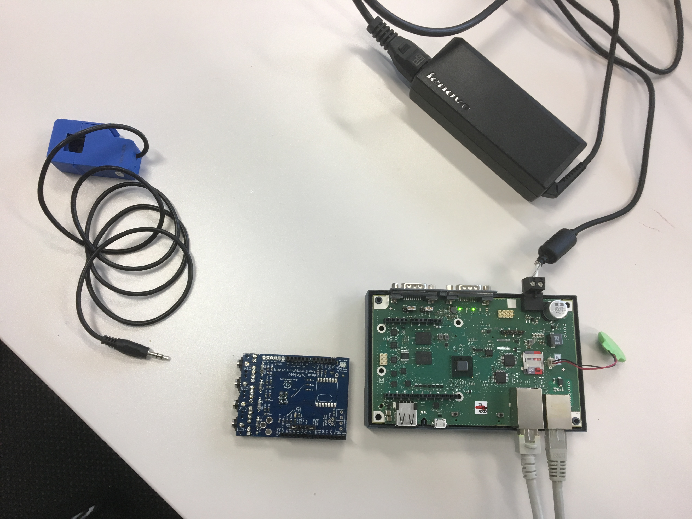

## Finding the right Hardware

For kettles we needed to monitor current. The kettles themselves did not have any sensor output and connecting to them in the kitchen was not easy as everything in the installation wall had to be IP68 water proof. So we had to do a retrofit solution adding sensors in the switch cabinet.

We found current sensors that are non-invasive and clip around each wire of the 3 phases. We had to connect them to a controller of some kind that would read the measurement and serve it to our device management. We found a solution with the [Siemens IOT2040](https://mall.industry.siemens.com/mall/de/WW/Catalog/Product/6ES7647-0AA00-1YA2) and the [Open Energy Monitor Shields](https://wiki.openenergymonitor.org/index.php/EmonTx_Arduino_Shield#emonTx_Arduino_Shield) that would allow us to take the shield and plug it to a siemens 2040 controller.

We had to solder the components onto our board but this was a one-time, simple, manual task. The other option would have been current sensors that wirelessly transmit the value to a local gateway. panoramic.io offers such a solution - but it's a closed solution. It would not have allowed us to do local control loops with an opc-ua server and add other sensors later.

The image below shows the hardware shortly before beeing assembled on our desk. One of the current sensors is in blue, then you see the arduino shield to put into the Siemens controller and the Siemens controller itself (already opened up to make assembly possible). The shield sticks out on the left side from the controller and a hole has to be cut into the (plastic) case for this purpose. When it's mounted in the switching cabinet to the left there has to be free space.

In the switching cabinet we used an off-the-shelve power supply instead of the laptop power supply shown in the picture.

For most of the Hardware we bought 2 devices instead of only 1 in the prototyping phase. This is recommended for multiple reasons:

*  you always have a backup if a device fails
*  you can use one device on your desk to simulate and one in "production" in the real live context to compare and debug any issues that may arise

As with any IoT use case "bugs" can occur anywhere in the mechanics (e.g. sensor plug not all the way in), sensors (e.g. sensor sensitivity to low), electronics (e.g. power supply inefficient) and software (e.g. own coding or configuration of third party software) and worse in the combination of all of the above with each other.

