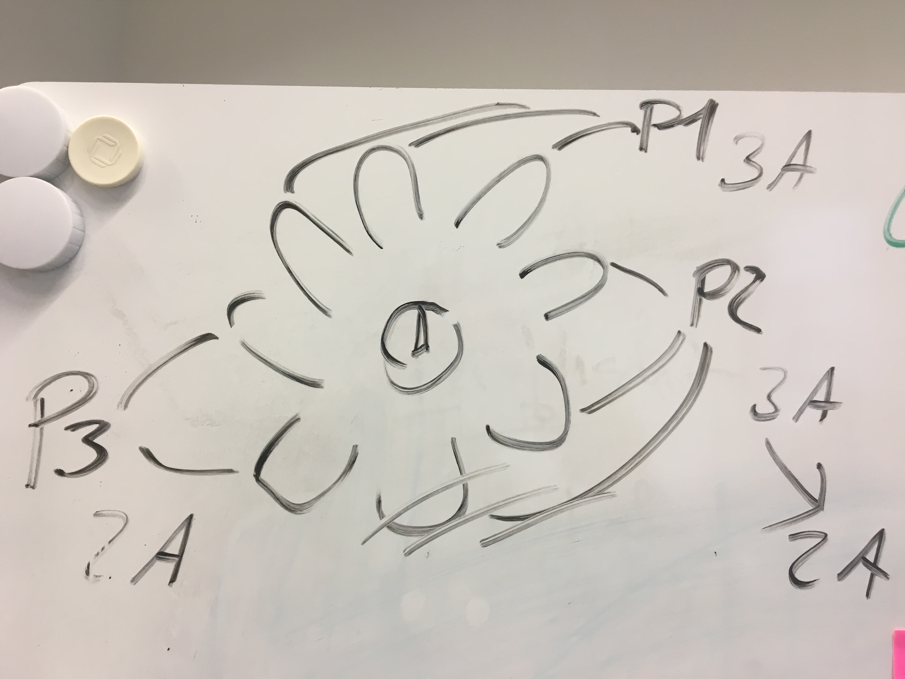
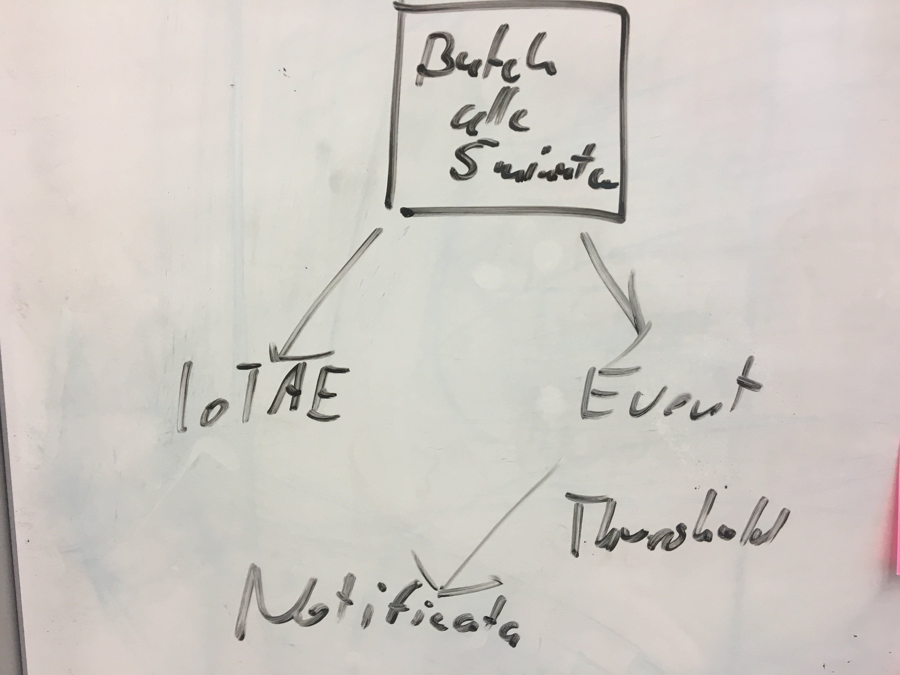

## Build Notification App

The Image at  shows that one kettle has 8 heating elements (could be more or less). If each of them consumes 1 Ampere in normal operation one of them failing will reduce the current from one phase by 1 ampere. In the image this is shown for Phase 2.

We feel that we have to build an app, that monitors the current over time and if the relative current of only one of the phases drops then we can assume, that a heating element has failed. In this case we want to create an event first and then, if there are more then 1 heating elements for one kettle broken, send an sms and and email to the people who then could decide to call a service technician.

Image  shows how the application is supposed to work. Because iot ae has no ingestion rule processing yet and we also do not need real-time processing we choose to use a batch job running in CF every minute. This would access the last 1 minute of data and check, if there is the situation we are looking for. Then it would create the event and if for a given machine there are 2 consecutive events it would then call the sms and email service.

In SAP cloud platform we did not find an easy to consume sms service - only something called sms 356 but to make use of it we would have had to call our SAP account manager which would have taken a lot of time. Instead we signed up for a sms gateway service in the cloud and called its rest apis to send out an sms. But for now we only created an event and will do the sms later.

## Building the application

We found the github content with a node js wrapper for iot application enablement that would make our live easier if we use node js - so we decided to use node for this application. The github library is described here: https://blogs.sap.com/2017/12/22/node.js-sdk-for-sap-iot-application-enablement-available-on-github/

We then looked for tutorials on how to build and deploy a CF app in SAP Cloud Platform but there was no such tutorial - only one for CF app that would sit on top of S/4. We use the second section in this tutorial at https://www.sap.com/developer/tutorials/s4sdk-cloud-foundry-sample-application.html

I finally found a tutorial at https://help.sap.com/viewer/65de2977205c403bbc107264b8eccf4b/Cloud/en-US/8105b26e430a4aea9dc46a7aa6f8d011.html that allowed me to build the first node app. This app worked out of the box once I did a manual install of the express package and changed the package.json content to not refer to the pnode js package in a simpler way.

Then i found a blog which was referring to a node js wrapper which seems to be going in the direction that I need. As the notification app needs to run without a user in front of it the client credential flow authentication is required to be used and this example wraps it: https://blogs.sap.com/2017/12/22/node.js-sdk-for-sap-iot-application-enablement-available-on-github/

I struggled with the later instructions but when I found out, that I had to add a manifest.yml and that I had to add a real server (otherwise the app would just finish and this looked like it crashed) I combine the server from the previous instructions and got it to work.

The source code is at [code](../../Nodejs/node-event-generator)

## Finding the right IoT AE API

Then I had to find out, how to find the average of the current for the last 2 minutes per thing and check if there was a situation, where the average was above 32 for one and not for the other phases. For those things I would want to create an event.

So I used postman to finetune the query to get what I needed and I create a dumy thing for which I created a case, where this would be the case.

I found in the api this api which seems to do what I need: https://help.sap.com/viewer/350cb3262cb8496b9f5e9e8b039b52db/latest/en-US/4889f896a14749d581db25666e525ae8.html

So for example Phase 1:

```
https://refapps.iot-sap.cfapps.eu10.hana.ondemand.com/analytics-thing-sap/ref.apps.kettle:ConsumedPowerb/aggregates?$filter=time%20ge%20datetime%272018-02-08T10:11:00%27%20and%20time%20lt%20datetime%272018-02-08T10:13:00%27
```

returns the averages across all kettles for this timeframe, the following gives me a list of thing ids and averages per thing:

```
https://refapps.iot-sap.cfapps.eu10.hana.ondemand.com/analytics-thing-sap/ref.apps.kettle:ConsumedPowerb/aggregates?$select=id,CurrentPhase3b_AVG,CurrentPhase2b_AVG,CurrentPhase1b_AVG&$filter=time ge datetime'2018-02-08T10:11:00' and time lt datetime'2018-02-08T10:13:00'
```

which looks like this in XML:

    ```
    <?xml version="1.0"?>
    <feed xmlns="http://www.w3.org/2005/Atom" xmlns:m="http://schemas.microsoft.com/ado/2007/08/dataservices/metadata" xmlns:d="http://schemas.microsoft.com/ado/2007/08/dataservices" xml:base="https://analytics-thing-sap.cfapps.eu10.hana.ondemand.com:443/">
      <id>
    https://analytics-thing-sap.cfapps.eu10.hana.ondemand.com:443/aggregates
    </id>
      <title type="text">aggregates</title>
      <updated>2018-03-07T16:59:18.773Z</updated>
      <author>
        <name/>
      </author>
      <link href="aggregates" rel="self" title="aggregates"/>
      <entry>
        <id>
    https://analytics-thing-sap.cfapps.eu10.hana.ondemand.com:443/aggregates('time%3D2018-02-08T10%3A11%3A00Z%2Cduration%3DALL%28T2M%29%2Cid%3D76757DFB166644E09BF8675271E6AA7D')
    </id>
        <title type="text">aggregates</title>
        <updated>2018-03-07T16:59:18.773Z</updated>
        <category term="ref.apps.kettle.ConsumedPowerb_aggregates" scheme="http://schemas.microsoft.com/ado/2007/08/dataservices/scheme"/>
        <link href="aggregates('time%3D2018-02-08T10%3A11%3A00Z%2Cduration%3DALL%28T2M%29%2Cid%3D76757DFB166644E09BF8675271E6AA7D')" rel="edit" title="ConsumedPowerb_aggregates"/>
        <content type="application/xml">
          <m:properties>
            <d:id>76757DFB166644E09BF8675271E6AA7D</d:id>
            <d:CurrentPhase3b_AVG>36.58880615234375</d:CurrentPhase3b_AVG>
            <d:CurrentPhase2b_AVG>35.954315185546875</d:CurrentPhase2b_AVG>
            <d:CurrentPhase1b_AVG>34.05085372924805</d:CurrentPhase1b_AVG>
          </m:properties>
        </content>
      </entry>
    </feed>
    ```

So now I have to scan through this list and find which one of them is showing a bad pattern.

## Deploying

After building the app I had to deploy it to the cf space we were using. I used cf push to do so.

## Having a way to test

I could not go donwstairs and destroy a heating element to test and I did not have historical data to test this on. And I wondered how to test the app with streaming data. I came up with the idea to build a little test firmware on the siemens device (could be run on any device, also on the pi) that once started would generate the test data we need for a virtual kettle and would do it in a repetitive fashion (cycling through a set of data with all sorts of patterns every 1 minute).

I would of course have to separate this test device from the real devices somehow. I figured to separate it in the ui controls a separate thing type and property set would be required and I would look at the result with a special second app or even with some automated scripts.

The test usese a "simulation" command from the firmware and then for the minutes in each minute generates these values for the 3 phases for each minute:

Phase 1: (for the first 10 minutes nothing sent) 10 10 10 10 10 10 10 10 10 10 20 20 20 20 20 20 20 20 20 20 30 30 30 30 30 30 30 30 30 30 40 40 40 40 40 40 40 40 40 40 50 50 50 50 50 50 50 50 50 50

Phase 2: (for the first 10 minutes nothing sent) 10 10 10 10 10 10 10 10 10 10 20 20 20 20 20 20 20 20 20 20 30 30 30 30 30 30 30 30 30 30 40 40 40 40 40 40 40 40 40 40 50 50 50 50 50 50 50 50 50 50

Phase 3: (for the first 10 minutes nothing sent) 10 10 10 10 10 10 10 10 10 10 20 20 20 20 20 20 20 20 20 20 30 30 30 30 30 30 30 30 30 30 40 40 40 40 40 40 40 40 40 40 0 0 0 0 0 0 0 0 0 0

The last 10 values should lead to an event as 2 phases are at 50 amps and one is at 0 which indicates a problem.
The first 10 values not being sent for 10 minutes is to check, that we do not get new values on the server in this time period.

All of this was an enhancement of the standard firmware and was triggered based on a configuration setting.
